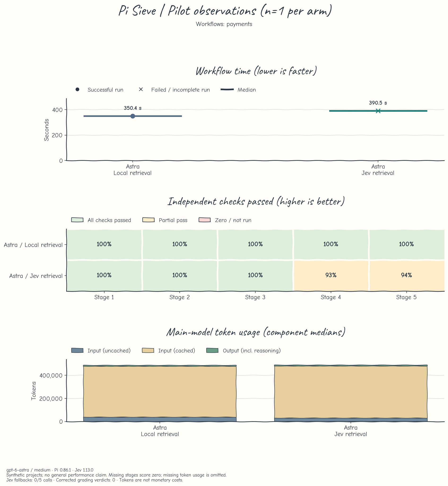
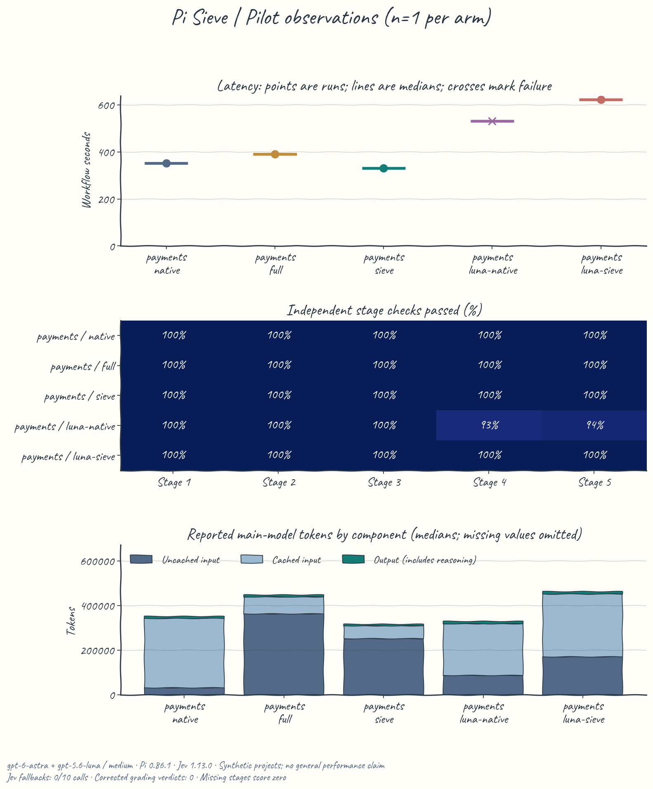
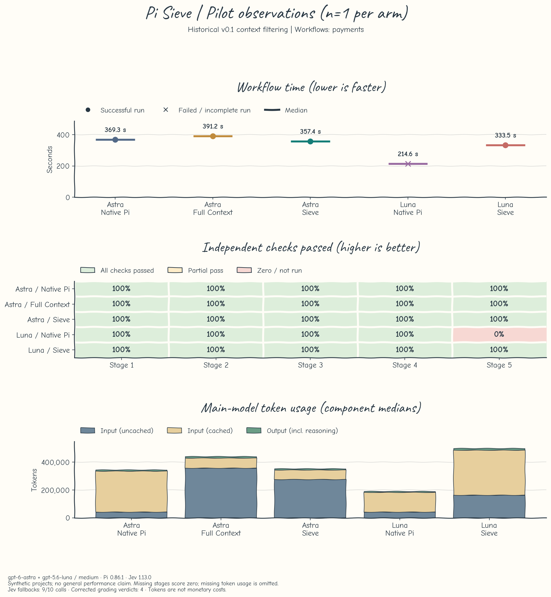

# Pi Sieve Bench

A public, reproducible comparison of Native Pi, full reference injection, and
[Pi Sieve](https://github.com/yoonshilee/pi-sieve) on five-stage development workflows.
All projects and reference data are fictional. This repository contains no shared
credentials. Live runs consume the operator's own model and TypeSafe allowance.

This repository contains the complete experimental setup, results, failure
analysis, and sanitized run data. Historical visualizations remain here as archived diagnostics. **Only pilot data is available; no formal batch
has been run.** The latest pair evaluates v0.2 on-demand retrieval at `ba996c7`.
Earlier five-arm pilots evaluate historical v0.1 context filtering at `7d54c8f`;
their results are kept separate.

[Retrieval comparison](#on-demand-retrieval-comparison) · [Historical setup](#historical-five-arm-experiment) · [Results](#results) · [Reproduction](#setup-and-commands)

New on-demand experiments use **openai-codex/gpt-5.6-sol, medium**. Saved Astra
and Luna measurements retain their original model identities. Changing the model
requires a new batch ID. Earlier experiments are archival diagnostics, excluded
from future release performance claims. Report and chart updates are deferred.

## Local delegated-command comparison

The v0.4 experiment compares **direct Sol decisions** with **Jev-selected commands**,
using Sol medium in both arms. Each completes the same five-stage payment workflow
three times, serially in alternating pair order. Before editing production code
in each stage, direct Sol chooses and executes a useful diagnostic command. The
Jev arm supplies 3-5 eligible commands, facts, and a neutral shared rubric, calls
`sieve_score` once, and executes the exact returned selection without reranking.
Sieve picks the highest score; ties use input order. It does not execute commands.

Both arms expose the same fixed tool definitions, skills, references, and code.
Direct Sol uses `/sieve off`; it has no mandatory rubric, ranking, or decision-file
writing. This control is not unmodified native Pi. An observer validates selection
against supplied candidates and scores, then checks the **first subsequent Bash
command**, whether its assistant message was generated after the Jev result,
completion, and tool-error flag. A failing diagnostic command may be
valid execution; task correctness is graded separately. No benchmark observer
forces compliance. Hashes replace command text in saved observations.

This is an end-to-end intervention, including candidate-generation overhead, not
a scorer-only comparison on identical candidate sets. Prompts cannot prove that
the main model avoided choosing internally before delegation. Commands and rubrics
can differ across repeats. Five fixed stages share a session and file changes;
hidden grading gives no feedback. Limits are 5 minutes and 30 main-model requests
per stage, with no automatic retries or selective reruns.

Keep the plugin adjacent at `../pi-sieve`, on the clean commit pinned by
`SCORING_COMMIT` in `src/metrics.ts`, then run:

```sh
npm run check
npm run score -- decision-local-001
```

The SDK integration test needs that checkout; it skips when absent. Live execution
requires the exact clean commit and native Pi credentials. Jev uses a 10-second
benchmark timeout; the production default remains 1.5 seconds. Saved results cannot
establish production availability under that shorter deadline. Fixture callback
contracts reject whitespace-only identifiers; historical fixtures are unchanged.

Whitelisted results are saved under `reports/<batch>/`. Resume with the same batch
ID; existing failed and completed attempts are preserved. Time includes model,
tool, and Jev calls; initialization and grading are separate. Tokens distinguish
uncached input, cached input, output, and available reasoning counts. Missing usage
and actual charges remain null. Error diagnostics save categories only, never raw
provider errors. Workspaces and raw artifacts remain ignored by Git.

Speed ratios use only paired successful runs with valid observed execution. All
failures remain in group summaries. Three repeats cannot establish significance;
provider caches cannot be reset. Earlier v0.3 advisory-scoring runs and their
transcription artifacts remain archival and are not pooled with v0.4. No charts
or public performance claims are produced; changes stay in local commits.

## Historical five-arm experiment

| Setting | Fixed value |
| --- | --- |
| Pi SDK | 0.86.1 |
| Main models | openai-codex / gpt-6-astra and gpt-5.6-luna |
| Reasoning | medium |
| Sieve commit | 7d54c8f2865d81113688e40b79abcef2956f6a32 |
| Jev | jev-1.13.0 |
| Sieve settings | 10-second timeout; published defaults for 40 candidates, 6 documents, 8,000 characters, and thresholds |
| Limits | 5 minutes and 30 main-model requests per stage |
| Formal design | 4 workflows × 5 arms × 3 repetitions = 60 runs / 300 stages |
| Pilot | Payments only, one complete run per arm; excluded from formal results |

| Arm | References | Skills and extension tools |
| --- | --- | --- |
| Native | Shared index; read bodies on demand | All available |
| Full | All 28 memory/guide bodies temporarily injected on every model turn | All available; skill bodies remain on demand |
| Sieve (Astra) | Real pinned plugin and real Jev selection | Real filtering and `sieve_search` recovery |
| Luna Native | Same on-demand baseline with gpt-5.6-luna | All available |
| Luna Sieve | Same real Sieve treatment with gpt-5.6-luna | Real filtering and recovery |

Each fixture has 20 memories, 8 command guides, 6 skills, and 6 read-only tools.
All arms receive the same index, starting files, user instructions, credentials,
reasoning settings (with model identity explicitly varied by arm), deterministic tool data, and sandboxed built-in tools. Mandatory
project instructions are never filtered. Full is an explicit all-context
baseline, not a claim about default Pi behavior. Only the Sieve arms have their recovery tool;
that is part of the treatment being measured.

## Workflows

| Workflow | Five stages | Independent acceptance |
| --- | --- | --- |
| Payments | Reproduce → sequential idempotency → concurrency → callbacks → regression | No duplicate charges, conflict rejection, recoverable failures, receipt uniqueness |
| Tenant API | Inspect → isolation → cursors → legacy compatibility → regression | Tenant boundaries, stable pages, projection, complete legacy results |
| Reconciliation | Inspect → CSV/money → UTC/deduplication → reporting → incremental re-import | Exact cents, CSV dialect, date boundaries, deterministic counts and totals |
| Incident | Evidence → retry policy → worker → downstream deduplication → report | Bounded retries, permanent errors, actual evidence IDs, independent request keys |

The agent keeps the same session and changes through all five stages. Hidden
behavioral checks run after each stage without exposing results to the agent.
The last stage repeats all relevant behavioral checks. A workflow succeeds only
if all five stages finish normally and every final check passes. Stage scores are
averaged with equal weight; missing stages score zero. Reference solutions and
intentionally broken starters validate the graders offline; they are never given
to the live model.

## Setup and commands

Live execution currently requires macOS, `sandbox-exec`, Node 22.19+, Python 3.9+,
Pi credentials for the pinned main model, and TypeSafe configured through Pi's
`/login typesafe` or `TYPESAFE_API_KEY`. Existing native Pi credential resolution is
reused; do not copy auth files into this repository. Other user packages, skills,
context files, and model configuration are not loaded.

```sh
npm ci --ignore-scripts
python3 -m venv .venv
.venv/bin/pip install -r requirements.txt
npm run check
npm run pilot -- --batch pilot-001
npm run report -- pilot-001
```

Inspect the five-run pilot and its projected use before authorizing formal work.
**The implementation does not launch the formal batch automatically.** After the
user explicitly confirms it:

```sh
npm run run -- --confirmed --batch formal-001
npm run report -- formal-001
```

Use the same batch ID to resume unstarted runs. Recorded attempts are preserved,
including failures. An interrupted in-progress attempt is marked interrupted,
not silently retried. Source changes invalidate resumption; use a separately
identified experiment for revised code. Three consecutive main-model provider
failures pause a batch. Jev failures remain ordinary Sieve fallback observations.
No automatic model retries or context compaction are enabled. Server-side cache
behavior cannot be reset; order rotates all five arms across the twelve workflow/repetition blocks. Runs are serial.

## Measurements and saved data

Every batch has a frozen manifest, one JSON record per run, generated JSONL/CSV,
a summary, a Markdown report, and PNG/SVG plots. Request payloads are measured in
bytes and discarded; reference context is measured in characters. Neither measure
is labeled as tokens. Model usage is accumulated only from completed assistant
messages, with reasoning treated as a subset of output, not added twice. Missing
usage is null. Jev usage is observed from a response clone; its request is neither
modified nor retried. `/sieve status` supplies fallback and selection diagnostics.

Measured stage time includes selection, model work, and tools. Initialization,
external grading, and between-stage reporting are recorded separately or excluded.
All run times are shown with success counts. Speedup ratios use successful matched
workflow/repetition pairs only, with all five Jev selections successful in the Sieve arm; fallback runs cannot become Jev speedup claims.
Small sample ranges and individual points are shown, without a statistical
significance claim. Token quantities are not invoices; subscription pricing and
missing Jev usage prevent a trustworthy dollar total.

The Pi Sieve README shows a compact, explicitly preliminary pilot figure and links
here for methods, results, and limitations. Figures and sanitized data are public
in this repository. Pilot observations remain separate from any future confirmed
formal batch and do not establish general performance gains.

Charts use Matplotlib's sketch styling, bundled Caveat titles, and Comic Neue
labels, legends, and numbers. The fonts are distributed under the SIL Open Font
License: [Caveat](assets/fonts/OFL.txt) and [Comic Neue](assets/fonts/ComicNeue-OFL.txt).
Comic Neue Regular and Bold are unmodified files from
[Google Fonts at e44c4b0](https://github.com/google/fonts/tree/e44c4b011a820c2cbe2fd2cfa8052037d7edb571/ofl/comicneue);
Caveat comes from [5571d84](https://github.com/google/fonts/tree/5571d84c0d8c70ec1af4f64072d8c5cf1e4e9643/ofl/caveat).
Rendering is offline. Heatmap cells use pale green for all checks passed, amber
for partial passes, and pink for zero or unrun stages. Styling does not change
any measurements.

## On-demand retrieval comparison

The historical runner and five arms remain pinned to v0.1. A separate comparison
loads v0.2 at `ba996c7` under both conditions: `retrieval-local` uses `/sieve off`,
and `retrieval-jev` uses `/sieve on`. Both retain the same tool definition, initial
files, six skills, six extension tools, and 28 references. The main model is
`openai-codex/gpt-5.6-sol` with medium reasoning for new batches. The saved
2026-09-21 pair used Astra.
The historical `pilot` and `run` commands retain the original Astra/Luna design
for reproduction and are separate from this current comparison.

```sh
npm run compare -- retrieval-001
npm run report -- retrieval-001
```

This command makes **two live five-stage payments runs**, local first and Jev
second. Each stage explicitly requests a frozen query before the original task;
additional reads remain available. This measures a controlled retrieval workflow,
not whether the model spontaneously chooses the tool. It uses the shared 10-second
benchmark timeout, not the 1.5-second production default. It does not launch a
formal batch or retry failed workflows. Existing run records are preserved.

The manifest freezes queries and necessary-reference names before execution.
Search results record reason codes, counts, duration, names, and character volume;
no reference body or raw request is saved. Query equality is recorded as a boolean.
First-search recall is measured against stage-specific necessary references and
is separate from independent task correctness. Reports include main requests,
uncached/cached input, output, Jev usage, and complete workflow time. A successful
speed pair requires both tasks to pass and every stage to retrieve successfully.
Provider caches and execution order remain uncontrolled. One pair cannot establish
statistical significance; tokens are not actual monetary charges.

## Privacy and repository checks

The SDK reads native credentials in the controller. Agent shell processes receive
an allowlisted environment, no model credentials, no network access, and no access
to home-directory files outside their own workspace or the Node runtime. File tools
reject paths outside the workspace. References are read-only. The external grader
is sent to a separate process after agent work; it is not placed in the task files.

`.work/`, `.local/`, `.venv/`, environment files, and raw logs are ignored. Saved
records contain allowlisted metrics, check IDs, and final text only; private paths
are replaced. Requests, provider error bodies, authentication headers, and thinking
content are never saved. PNG files are generated plots; textual records and Git
history are scanned for secrets and private identity. This benchmark does not
perform deployments or external tool actions.

Configure repository-local public Git identity and enable `.githooks` before
committing. Run `npm run check`, `node scripts/check-privacy.mjs --history`, and
`gitleaks git --log-opts=--all --redact --no-banner --log-level error .`.
CI performs offline checks and plot generation without real credentials.

## File map

- `src/fixtures.ts`: starting projects, fixed prompts, references, and tool data.
- `src/runner.ts`, `sandbox.ts`, `grade*.ts`: real sessions, guarded tools, and independent graders.
- `src/metrics.ts`, `report.ts`, `cli.ts`: records, summaries, batch execution, and resumption.
- `test/`: known-good and broken implementations, SDK checks, and measurement checks.
- `reports/`: sanitized measured outputs; no live workspace copies.

## Results

No formal benchmark has been run. The v0.2 pair and historical v0.1 pilots below
are separate experiments and must not be pooled.

### On-demand retrieval: 2026-09-21, v0.2

**This pair did not show a speed or task-quality gain from Jev selection.** Both
conditions used Astra medium, identical starting files and fixed queries, five
stages, and the same Sieve tool. All five Jev calls returned HTTP 200 and valid
selections, with zero fallbacks. The benchmark used a 10-second timeout; the
production default remains 1.5 seconds.

| Metric | Local retrieval | Jev retrieval |
| --- | ---: | ---: |
| Workflow success under frozen grader | 1/1 | 0/1 |
| Mean stage acceptance | 100.0% | 97.3% |
| Workflow seconds | 350.412 | 390.522 |
| Main-model requests | 33 | 34 |
| First-search required-reference recall | 100.0% | 90.0% |
| Returned search-result characters | 13,223 | 11,350 |
| Median retrieval milliseconds | 36 | 2,318 |
| Uncached main input tokens | 38,539 | 30,615 |
| Cached main input tokens | 440,704 | 449,536 |
| Main output tokens | 8,002 | 8,704 |
| Total main tokens | 487,245 | 488,855 |
| Jev input / output tokens | N/A | 17,453 / 2,490 |

Jev took 40.110 seconds longer (+11.4%), returned 14.2% fewer search-result characters
(including headings and formatting), and
used 20.6% less uncached main input. It did not reduce main requests or total main
tokens (+0.3%). Retrieval added about 13.5 seconds in total; the remaining elapsed
difference includes different model/tool trajectories and service variation.
Both conditions retained high reported input cache shares (92.0% and 93.6%);
this is not a direct KV-cache measurement or evidence of a causal cache benefit.
Actual dollar charges are unavailable, and the extra Jev use prevents treating
reduced uncached input alone as a cost-saving result.

The Jev run failed `invalid-event-no-mutation` in stages 4 and 5: it accepted a
whitespace-only callback charge ID and mutated state. Both required callback
references were returned. **The reference says "nonempty" without explicitly
requiring trimming, while the frozen grader expects "nonblank".** This ambiguity
limits the quality comparison; original verdicts are retained, and the failure
cannot be attributed to Jev from this pair. The `gateway-failures` reference was
omitted at stages 3 and 5, although related retry checks passed.

There is no successful matched pair for a speedup ratio. One pair, local first,
cannot establish statistical significance; provider caches, order, and model
trajectories were not controlled. This result suggests that the already effective
local retrieval in this small fixture left little room for Jev to save work.
No additional model runs were used to select a better outcome.

[Complete retrieval report](reports/retrieval-20260921-v02/README.md) · [CSV](reports/retrieval-20260921-v02/runs.csv) · [JSONL](reports/retrieval-20260921-v02/runs.jsonl) · [Failure reproduction](reports/retrieval-20260921-v02/failure-analysis.json)



### Historical v0.1 revised pilot: 2026-09-21, 10-second timeout

**Jev returned valid selections for all 10 calls, with zero fallbacks.** Each arm has one payment workflow; this is preliminary evidence, not a general performance claim.

| Arm | Workflow success | Stage checks | Seconds | Main-model tokens | Jev success / calls |
| --- | ---: | ---: | ---: | ---: | ---: |
| Astra Native | 1/1 | 100.0% | 352.544 | 350,640 | N/A |
| Astra Full Context | 1/1 | 100.0% | 390.525 | 447,221 | N/A |
| Astra Sieve | 1/1 | 100.0% | 331.159 | 316,979 | 5/5 |
| Luna Native | 0/1 | 97.3% | 530.273 | 328,819 | N/A |
| Luna Sieve | 1/1 | 100.0% | 622.971 | 462,932 | 5/5 |

Astra Sieve used 6.1% less workflow time and 9.6% fewer total main-model tokens than Astra Native in their one successful matched pair (1.06× duration ratio). Against Astra Full Context, time was 15.2% lower and tokens 29.1% lower (1.18×; one pair). These differences are observations, not estimates of a repeatable causal effect.

Luna Sieve passed all final checks but took 622.971 seconds and 462,932 tokens. Luna Native took 530.273 seconds and 328,819 tokens, but accepted a whitespace-only callback charge ID and failed final acceptance. There is no successful Luna-to-Luna pair for a speedup calculation. Against successful Astra Native, Luna Sieve was 1.77 times as slow and used 32.0% more total main-model tokens. This small-model configuration did not deliver a speed or token reduction in this sample.

**Cache matters:** Astra Native reported 32,577 uncached input tokens; Astra Sieve reported 250,907, despite fewer total tokens. Their cached input was 309,504 and 58,752 respectively. Fewer total tokens cannot be translated directly into lower monetary cost. Prior pilot runs and Jev diagnostic replays may affect server caching; service load was not controlled.

**Recorded use:** 1,906,591 main-model tokens across this batch (904,038 uncached input, 955,648 cached input, 46,905 output; 9,304 reasoning tokens are already inside output). Jev reported 51,714 input and 7,310 output tokens. Workflow execution totaled 37.12 minutes, excluding setup and independent grading. Actual dollar charges are unknown. Across both pilot batches, reported main-model usage totals 3,730,322 tokens; diagnostic probes are separate from workflow results.

**Formal estimate:** 60 workflows / 300 stages project to approximately 7.42 hours, 22,879,092 main-model tokens, and 120 Jev requests with approximately 620,568 input plus 87,720 output tokens. This extrapolates one payment workflow per arm; different workflows and service conditions can change it substantially. Formal execution has not started and requires user confirmation.

[Complete revised report](reports/pilot-20260921-jev10s/README.md) · [CSV](reports/pilot-20260921-jev10s/runs.csv) · [JSONL](reports/pilot-20260921-jev10s/runs.jsonl) · [Failure reproduction](reports/pilot-20260921-jev10s/failure-analysis.json)



### Historical v0.1 initial pilot: 2026-09-21, 1.5-second timeout

| Arm | Task success | Stage checks | Workflow seconds | Main-model tokens | Jev success / calls |
| --- | ---: | ---: | ---: | ---: | ---: |
| Astra Native | 1/1 | 100% | 369.254 | 343,184 | N/A |
| Astra Full Context | 1/1 | 100% | 391.248 | 439,193 | N/A |
| Astra Sieve | 1/1 | 100% | 357.435 | 352,118 | 0/5 |
| Luna Native | 0/1 | 80% | 214.568 | 190,624 | N/A |
| Luna Sieve | 1/1 | 100% | 333.530 | 498,612 | 1/5 |

The Luna Native attempt stopped on a provider error in stage 4; stage 5 was not
run. Its shorter duration is not evidence of superior speed. There were eight
Jev timeouts, one service error, and one successful selection. No valid Jev
speedup pairs remain. Total reported main-model use: **1,823,731 tokens**;
workflow execution: **27.77 minutes**. Missing usage on failed requests is unknown,
not zero. Actual dollar charges are not available.

The initial grader incorrectly required string-only evidence and a new test
filename. Uniform review accepted structured evidence and tests added to the
existing file, correcting three stage-one checks and one final artifact check.
Original verdicts, including Luna Sieve's original failed success flag, are retained.
Timing and token measurements are unchanged. See the
[complete report](reports/pilot-20260921/README.md) and
[review artifacts](reports/pilot-20260921/grading-review.json).



### Why the timeout changed

The pinned selector starts `AbortSignal.timeout(config.timeoutMs)` before `fetch`
and applies it to the whole response. Five separate fresh-process probes using
the original payment prompts and candidate catalog all returned HTTP 200 under a
10-second limit: **1,608, 1,522, 1,552, 1,384, and 1,396 ms**. Three would exceed the
original 1,500 ms deadline. Almost all elapsed time preceded the response headers.
Five probes in one process also succeeded (448–1,361 ms). Connection reuse, service
load, and server caching are not isolated by this small diagnosis. Credentials and
request schema worked; the earlier generic service error cannot be reconstructed
because its HTTP status was not recorded.

[Fresh-process measurements](reports/pilot-20260921/jev-fresh-process-diagnostic.json)
and [same-process measurements](reports/pilot-20260921/jev-workflow-diagnostic.json)
are separate from workflow metrics. The benchmark now materializes the following
project configuration identically for every arm:

```json
{ "timeoutMs": 10000 }
```

This changes the maximum wait, not a fixed sleep. Sieve's production commit and
selection thresholds stay pinned, with no retries. Future observations record
HTTP status and header latency without response bodies. The original batch is
preserved; a new batch ID is required for the revised settings.
